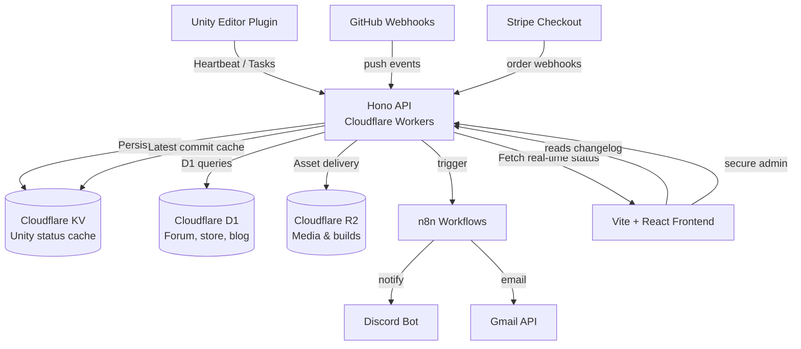

# Dev Command Center Architecture

The platform is composed of a Vite + React single-page application backed by a Hono API deployed to Cloudflare Workers. Data flowing in from Unity, GitHub and automation services is persisted in Cloudflare storage primitives and fanned out to community endpoints.

## Data responsibilities

| Component | Role |
| --- | --- |
| Unity Editor Plugin | Publishes working/break states, active task descriptions and session metrics every two minutes. |
| Hono API (Cloudflare Workers) | Normalises webhook payloads, writes to KV and D1, and exposes serverless endpoints consumed by the SPA. |
| Cloudflare KV | Ultra-fast cache for live Unity presence and the most recent GitHub commit. |
| Cloudflare D1 | Structured persistence for forum posts, store orders, admin analytics and automation logs. |
| Cloudflare R2 | Stores screenshots, marketing videos, downloadable builds and static assets served via the CDN. |
| n8n | Orchestrates cross-service automation spanning Discord alerts, Gmail newsletters and store fulfilment. |
| Stripe Checkout | Handles secure purchases and issues license keys through webhook callbacks to the Worker. |
| React Frontend | Multi-surface (overview, admin, forum, store) glassmorphism UI with live Unity presence, automation controls and commerce tooling. |

## Deployment flow

1. Commits merged to `main` automatically trigger Cloudflare Pages builds for the Vite frontend and Workers CI for the API.
2. The Worker receives secrets (n8n webhook, Stripe keys) via environment bindings managed in `wrangler.toml` / dashboard.
3. KV namespaces and the D1 database are provisioned in the same account to keep latency low.
4. Unity editor plugin sends webhooks to `/api/unity-status`, ensuring the homepage reflects sessions within seconds.
